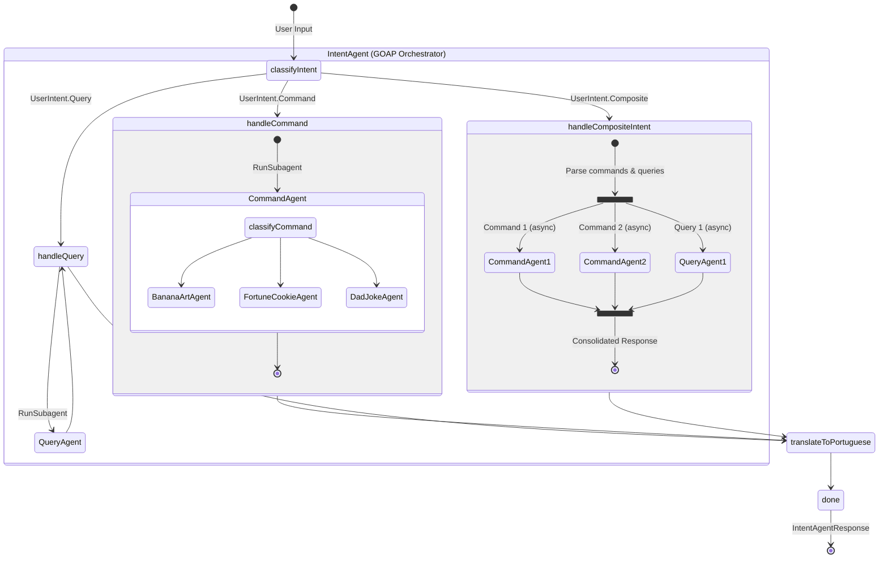

This project demonstrates advanced agent composition patterns using
the [Embabel framework](https://github.com/embabel/embabel-agent).

Uses Spring Boot 3.5.9 and Embabel 0.3.1.

It highlights two different approaches to building complex, multi-agent systems:

1. **GOAP with Parallel Processing** (Current Branch): Deterministic planning with concurrent sub-agent execution.
2. **Subagent/Supervisor Pattern** (Main Branch): LLM-driven orchestration.

## Architecture Patterns

### 1. GOAP with Parallel Processing Pattern (Current Branch)

This branch implements agent composition using Embabel's **GOAP (Goal-Oriented Action Planning)** with **parallel
processing support** for composite intents.

* **Entry Point:** `IntentAgent` coordinates all user requests.
* **Logic:**
    1. **Classification:** LLM classifies the user's intent into a sealed interface hierarchy (`Command`, `Query`, or
       `Composite`).
    2. **GOAP Routing:** The planner selects the appropriate `@Action` handler based on the specific intent type on the
       blackboard.
    3. **Parallel Execution:** For composite intents, `handleCompositeIntent` spawns multiple sub-agent processes
       concurrently using `CompletableFuture` and `AgentPlatform`.
    4. **Sub-agent Invocation:** Individual commands/queries use `RunSubagent.fromAnnotatedInstance()` for sequential
       execution, while composite intents use `agentPlatform.createAgentProcessFrom()` for parallel execution.
* **Benefits:** Highly deterministic, type-safe, leverages GOAP's planning capabilities, and achieves true parallel
  performance for composite requests.

#### Parallel Processing Features

The system now supports composite requests that combine multiple intents:

* **Multiple Intents**: "Show me a banana and tell me where they come from"
    - Executes both command (BananaArtAgent) and query (QueryAgent) in parallel
    - Results are combined into a unified response

* **Multiple Commands**: "Show me a banana and tell me a joke"
    - Executes multiple specialist agents concurrently
    - All results are joined together

**Implementation**: Uses Java's `CompletableFuture` for parallel execution, providing:

- Type-safe concurrent operations
- Standard Java patterns (no framework lock-in)
- Easy testing and debugging
- True parallel performance gains

#### Technical Implementation Details

The `IntentAgent` uses a sealed interface hierarchy for type-safe intent classification:

```java

@JsonTypeInfo(use = JsonTypeInfo.Id.NAME, property = "intent")
@JsonSubTypes({
        @JsonSubTypes.Type(value = UserIntent.Command.class, name = "COMMAND"),
        @JsonSubTypes.Type(value = UserIntent.Query.class, name = "QUERY"),
        @JsonSubTypes.Type(value = UserIntent.Composite.class, name = "COMPOSITE")
})
public sealed interface UserIntent {
    record Command(String description) implements UserIntent {
    }

    record Query(String question) implements UserIntent {
    }

    record Composite(List<Command> commands, List<Query> queries) implements UserIntent {
    }
}
```

**GOAP Routing**: The framework's planner automatically selects the correct handler based on the specific type:

- `handleCommand(UserIntent.Command)` → Delegates to CommandAgent sequentially
- `handleQuery(UserIntent.Query)` → Delegates to QueryAgent sequentially
- `handleCompositeIntent(UserIntent.Composite)` → Spawns parallel sub-agent processes

**Parallel Execution Pattern**: For composite intents, the implementation:

1. Looks up registered Agent instances from AgentPlatform
2. Creates CompletableFuture tasks for each command/query
3. Uses `agentPlatform.createAgentProcessFrom()` to spawn independent agent processes
4. Calls `agentProcess.run()` asynchronously
5. Joins all futures and consolidates responses with a separator (`\n\n---\n\n`)



### 2. Hierarchical Subagent Pattern (Main Branch)

The `main` branch demonstrates the **Hierarchical Subagent** pattern.

* **Entry Point:** `IntentAgent`.
* **Logic:**
    1. **IntentAgent** classifies the request and delegates to either `QueryAgent` or `CommandAgent` using
       `RunSubagent`.
    2. **CommandAgent** (if selected) performs a second classification to route to a specialist (Banana, Fortune, Joke).
    3. **Translation:** `IntentAgent` takes the final response from any subagent and translates it into Portuguese
       before returning.
* **Benefits:** Explicit, easy to follow control flow with reusable agents. Allows for post-processing (like
  translation) at higher levels.


# Running

Run the shell script to start Embabel under Spring Shell:

```bash
./scripts/shell.sh
```

When the Embabel shell comes up, invoke the intent router:

**Single intent examples:**
```bash
intent "Tell me a dad joke about Java"
intent "I want a fortune cookie"
intent "Show me a banana"
intent "Why is the sky blue?"
```

**Composite intent examples (parallel execution):**

```bash
intent "Show me a banana and tell me where they come from"
intent "Tell me a joke and give me a fortune"
intent "Show me a banana, tell me a joke, and give me a fortune"
```

The composite intents execute multiple operations in parallel and combine the results.

See [DemoShell.java](./src/main/java/com/example/embabelsubagenttest/DemoShell.java) for the implementation.
