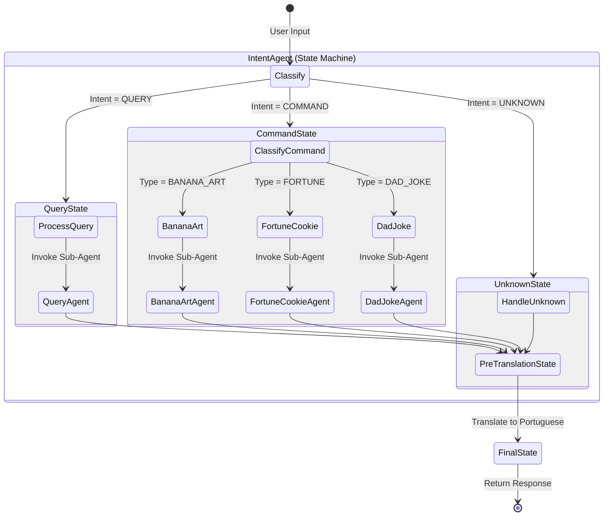
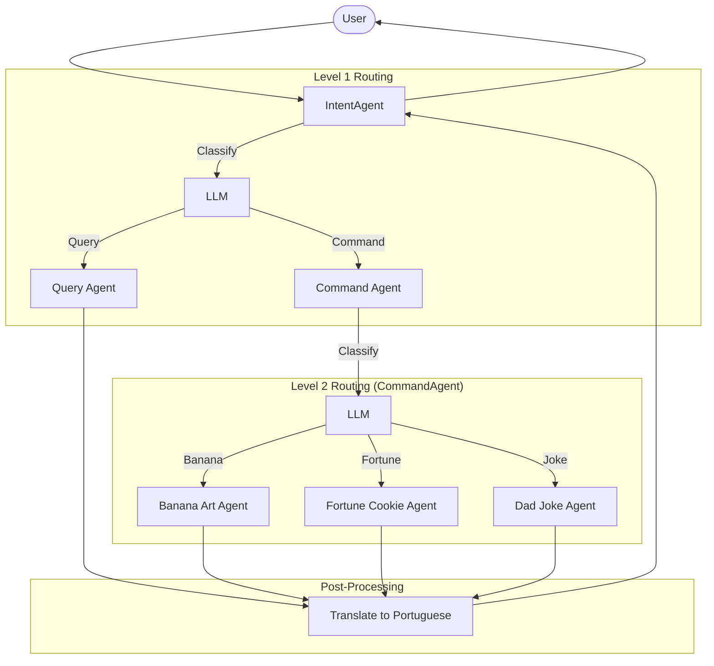

This project demonstrates advanced agent composition patterns using
the [Embabel framework](https://github.com/embabel/embabel-agent).

Uses Spring Boot 3.5.9 and Embabel 0.3.1.

It highlights two different approaches to building complex, multi-agent systems:

1. **State Machine Pattern** (Current Branch): Explicit state modeling for robust intent handling.
2. **Subagent/Supervisor Pattern** (Main Branch): LLM-driven orchestration.

## Architecture Patterns

### 1. State Machine Pattern (Current Branch)

This branch implements the **State Machine** pattern using Embabel's `@State` API with **parallel processing support**
for composite intents.

* **Entry Point:** `IntentAgent` acts as the state machine host.
* **Logic:**
    1. **Classification:** The initial state classifies the user's intent (Command, Query, Multiple, or Unknown).
    2. **Transition:** The system transitions to a specific typed state (e.g., `CommandState`, `QueryState`,
       `MultiIntentState`).
    3. **Parallel Execution:** For composite intents, multiple sub-agents execute concurrently using
       `CompletableFuture`.
    4. **Execution:** Inside the state, further logic (like finer-grained classification) occurs before invoking a
       sub-agent using `AgentInvocation`.
* **Benefits:** Highly deterministic, type-safe, easy to visualize, and performant with parallel execution. The flow is
  enforced by state transitions.

#### Parallel Processing Features

The system now supports composite requests that combine multiple intents:

* **Multiple Intents**: "Show me a banana and tell me where they come from"
    - Executes both command (BananaArtAgent) and query (QueryAgent) in parallel
    - Results are combined into a unified response

* **Multiple Commands**: "Show me a banana and tell me a joke"
    - Executes multiple specialist agents concurrently
    - All results are joined together

**Implementation**: Uses Java's `CompletableFuture` for parallel execution, providing:

- Type-safe concurrent operations
- Standard Java patterns (no framework lock-in)
- Easy testing and debugging
- True parallel performance gains



### 2. Hierarchical Subagent Pattern (Main Branch)

The `main` branch demonstrates the **Hierarchical Subagent** pattern.

* **Entry Point:** `IntentAgent`.
* **Logic:**
    1. **IntentAgent** classifies the request and delegates to either `QueryAgent` or `CommandAgent` using
       `RunSubagent`.
    2. **CommandAgent** (if selected) performs a second classification to route to a specialist (Banana, Fortune, Joke).
    3. **Translation:** `IntentAgent` takes the final response from any subagent and translates it into Portuguese
       before returning.
* **Benefits:** Explicit, easy to follow control flow with reusable agents. Allows for post-processing (like
  translation) at higher levels.



# Running

Run the shell script to start Embabel under Spring Shell:

```bash
./scripts/shell.sh
```

When the Embabel shell comes up, invoke the intent router:

**Single intent examples:**
```bash
intent "Tell me a dad joke about Java"
intent "I want a fortune cookie"
intent "Show me a banana"
intent "Why is the sky blue?"
```

**Composite intent examples (parallel execution):**

```bash
intent "Show me a banana and tell me where they come from"
intent "Tell me a joke and give me a fortune"
intent "Show me a banana, tell me a joke, and give me a fortune"
```

The composite intents execute multiple operations in parallel and combine the results.

See [DemoShell.java](./src/main/java/com/example/embabelsubagenttest/DemoShell.java) for the implementation.
